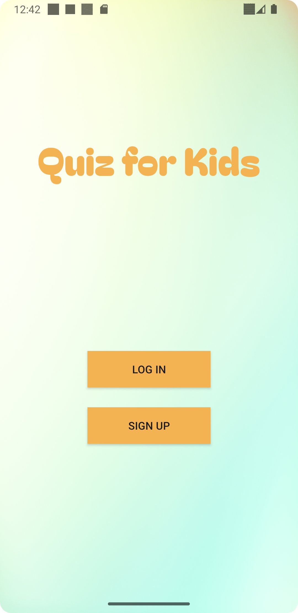
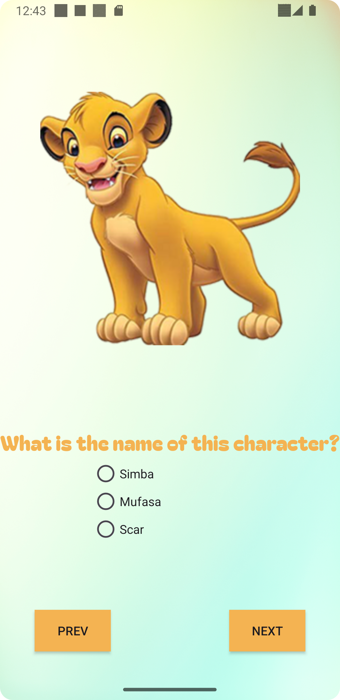
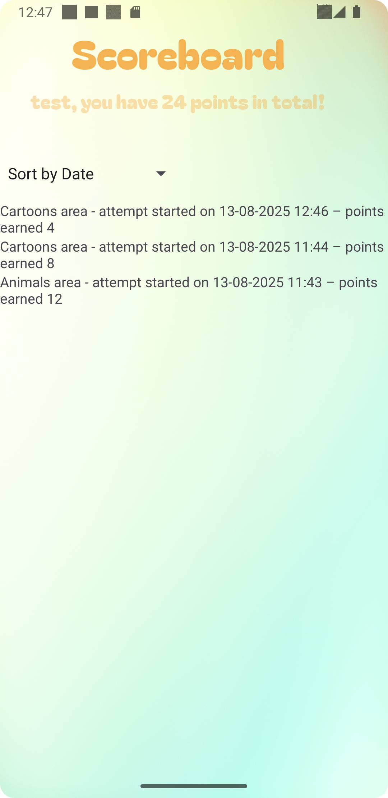

<h1>Android Studio-Project-Quiz for Kids</h1>

This project is an Android application called "Quiz for Kids", designed to provide an engaging and educational quiz experience for children. 
  It features two quiz categories: Animals🐾 and Cartoons🎬. 
Animals Quiz🐾: Image-based questions where users type the animal name. 
Cartoons Quiz🎬: Multiple-choice questions about cartoon characters. 
  
This project was an assignment for CSIT242-Mobile Application Development in University of Wollongong, Australia 

 
 
 

<h3>Project Description</h3>

An interactive Android quiz app for kids featuring animal image-guessing and cartoon multiple-choice challenges, built with a local database for storing user accounts, quiz questions, and scores, and enhanced with engaging animations like blink, fade-in, and scale for a fun learning experience.

<h3>Development Period</h3>

2025.05.14~2025.05.30

<h3>Development Environment</h3>
<li>Java</li>
<li>minSdk: 25</li>
<li>targetSdk: 35</li>
<li>Tested on Pixel 3a API 34, Pixel Tablet API 35</li>
  
<h3>Features</h3>
<li>User registration & login system</li>

<li>Randomized quiz questions from a local database</li>

<li>Scoring system: (Correct × 3) – (Incorrect × 1)</li>

<li>View past quiz attempts & sort by date or category</li>

<li>Responsive design for multiple screen sizes and orientations</li>

<li>Embedded animations for a fun experience</li>

<h3>Demonstration Video</h3>

